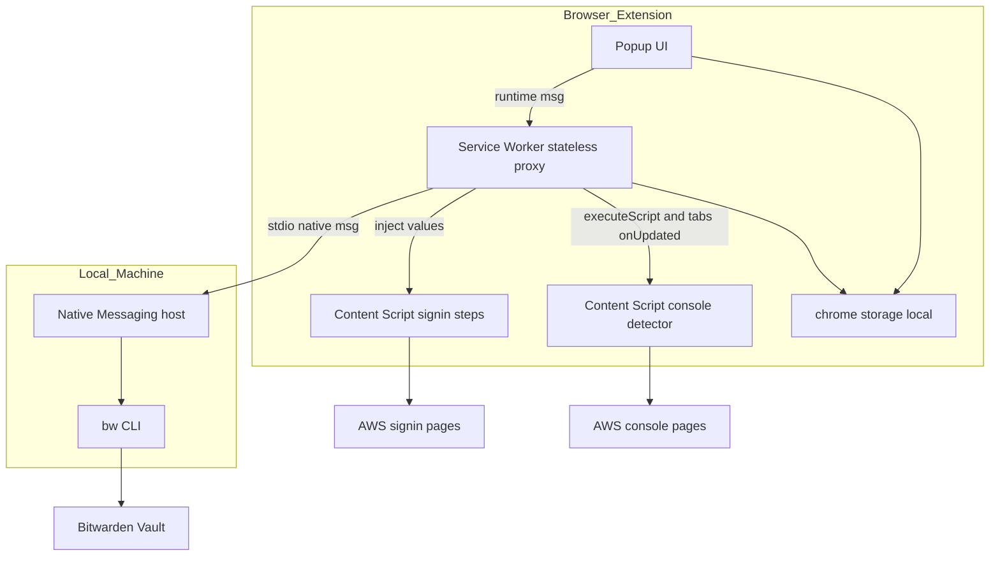
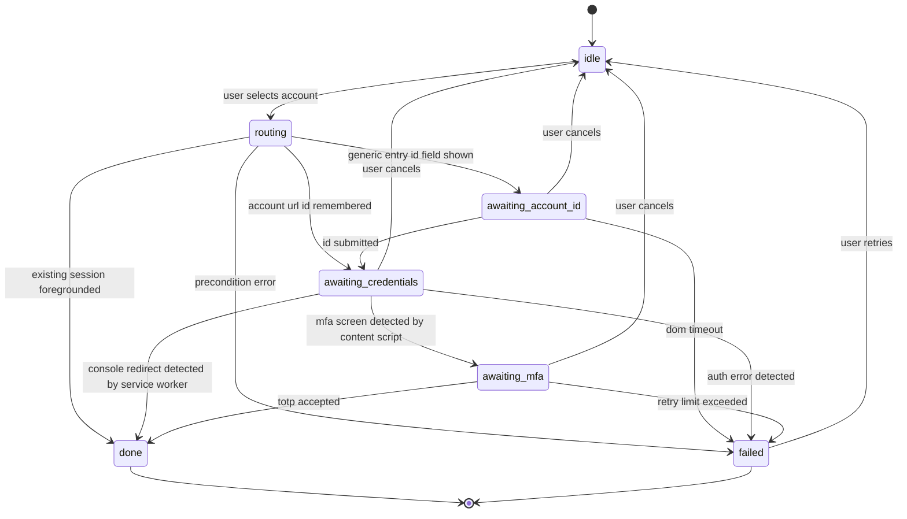
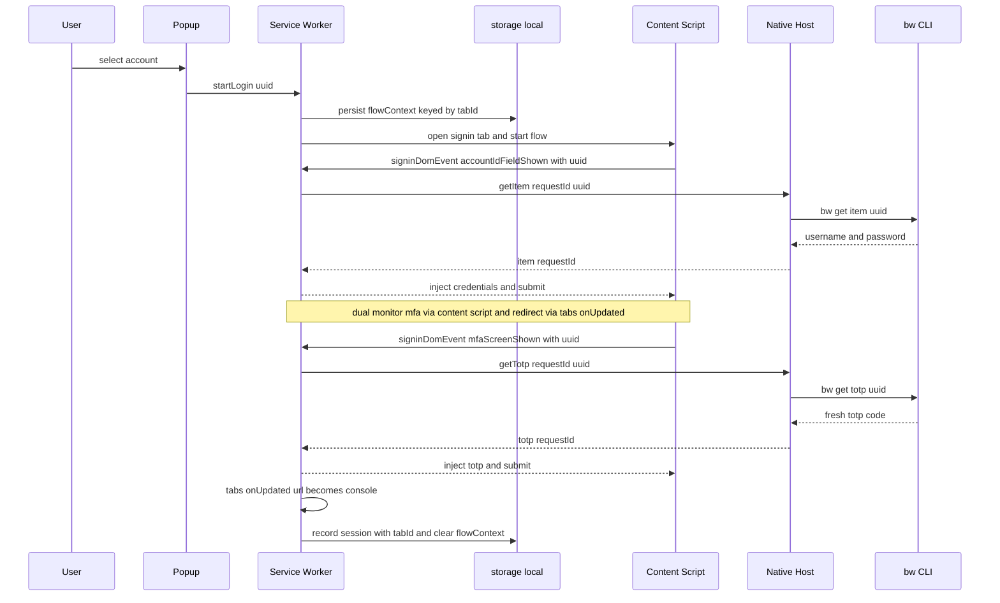
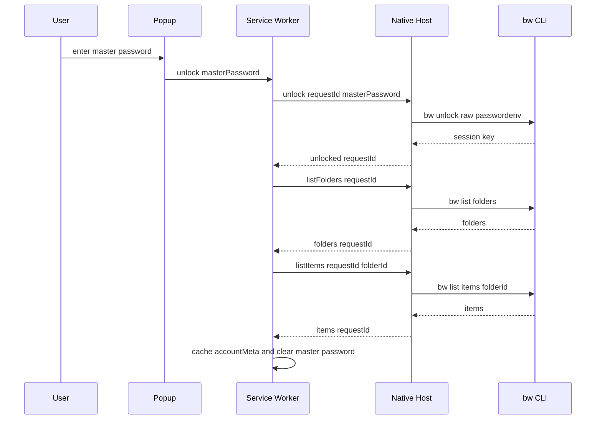

# 技術設計書: AWS Console Multi-Account Switcher

本設計書は承認済み要件定義書（[requirements.md](./requirements.md) v6）を、実装に必要なアーキテクチャ・コンポーネント契約・データモデルへ落とし込むものである。要件番号（例: 3.2, 4.1）は v6 の節番号を正準 ID として参照する。

## Overview

本機能は、複数の AWS IAM ユーザーアカウント間のコンソール切り替えを最小化する Chrome 拡張機能（Manifest V3）を提供する。Bitwarden Password Manager の Vault をシークレットの SSOT とし、ローカルの `bw` CLI を Native Messaging ホスト経由でラップしてオンデマンドにシークレットを取得し、AWS サインインフローを自動化する。

- **Purpose**: IAM ユーザー運用下でのログイン操作とコンテキストスイッチを削減する暫定ツールを提供する。
- **Users**: 多数の AWS IAM アカウントを日常的に切り替えるエンジニアが、認証情報を Bitwarden に集約したまま利用する。
- **Impact**: 手動ログイン運用を、拡張機能主導の半自動ログイン（能動利用窓内はゼロタッチ）へ置き換える。シークレットはホストプロセスのみが保持し、拡張側へは永続化しない。

### Goals

- AWS サインインの各ステップ（ルーティング → アカウント ID → 認証情報 → MFA）を DOM 検知ベースで自動化する（3.2）。
- Bitwarden Vault を SSOT とし、Native Messaging を第一経路としてシークレットをオンデマンド取得する（2.1, 3.3）。
- 最大 5 セッションの併存と前面化を実現する（3.2.1）。
- MV3 Service Worker のライフサイクル制約下でフローを破綻させないステートレス設計を確立する（2.2）。
- 認証プロバイダ・セッションマネージャ・シークレット取得経路をインターフェースで分離し、将来の SSO 移行に備える（4.2）。

### Non-Goals

- AssumeRole / IAM Identity Center（SSO）の実装。本設計はプラガブルな抽象化のみを用意する（4.2）。
- Bitwarden Secrets Manager の採用（2.1 で不採用確定）。
- マスターパスワードの永続保存による完全無人化（4.1.1 で非推奨）。
- 6 個超アカウントの恒久保持。上限超過は LRU 退避で扱う（3.2.1）。

## Architecture

### Architecture Pattern & Boundary Map

採用パターンは **ヘキサゴナル（ポート＆アダプタ）＋ステートレス・プロキシ**である。拡張中核（フロー制御・UI）からシークレットの取得経路を `SecretSourceAdapter` ポートで分離し、Native Messaging 実装を第一アダプタ、`bw serve` を代替アダプタとする。Service Worker は揮発状態を保持せず、メッセージ中継（プロキシ）に徹し、フロー状態は `chrome.storage.local` の `FlowContext` で再起動耐性を持たせる。



**Key Decisions**:

- **境界の分離**: 中核は `CredentialProvider` / `SessionManager` ポートにのみ依存し、Bitwarden 固有処理は `SecretSourceAdapter` 実装に閉じる（4.2）。SSO 移行時はアダプタ・プロバイダ実装の差し替えで対応する。
- **ステートレス SW ＋ 永続フロー状態**: SW は揮発状態を持たず、フロー状態は `tabId` をキーとする `FlowContext`（`chrome.storage.local`）に保存する。SW 終了後の再起動でも `FlowContext` から復元できる（2.2、後述「フロー状態の復元」）。
- **秘匿境界**: `BW_SESSION` とマスターパスワードはホストプロセスのみが保持し、拡張・`chrome.storage` には一切置かない（2.1.1, 4.1.1）。

### Technology Stack

| Layer | Choice / Version | Role in Feature | Notes |
| --- | --- | --- | --- |
| Frontend (Extension) | Chrome Extension MV3, TypeScript strict | Popup UI / SW / Content Scripts | `eval` 排除・厳格 CSP（4.1） |
| Messaging | Native Messaging (stdio) | SW とローカルホスト間の秘匿通信 | `allowed_origins` で拡張 ID 限定（2.1.1） |
| Native Host | ローカルプロセス（Node.js / Python、PoC #1 で確定） | `bw` ラップ・`BW_SESSION` 保持・アイドル自動ロック・TOTP 待機 | TTY 非対話のため `--passwordenv`（4.1.1） |
| Secret Store | Bitwarden Password Manager Vault, `bw` CLI | シークレット SSOT | `bw get item totp`, `bw list items folders` |
| MFA / TOTP | `bw get totp`（ホスト生成） | 6 桁コード生成・残秒数保証 | 拡張内 Web Crypto 生成は PoC #6 まで保留 |
| Storage | `chrome.storage.local` | 非秘匿メタデータ・セッション記録・フロー状態 | パスワード・TOTP は永続化禁止（3.3） |

代替経路 `bw serve`（`http://localhost:8087`）は開発/デバッグ用途に限定し、本番採用時は DNS リバインディングリスク受容が必要（2.1.2）。詳細比較は [research.md](./research.md) を参照。

## System Flows

### ログイン自動化ステートマシン（3.2, 3.5, 5）



**Key Decisions**:

- `awaiting_credentials` 状態は **二重監視**する。MFA 画面 DOM は Content Script の `MutationObserver` で検知し、コンソールへのリダイレクトは Service Worker が `chrome.tabs.onUpdated` で検知する（リダイレクトは HTTP 302 で CS が破棄されるため、CS からは検知不能, C-2）。MFA 未設定アカウントはリダイレクトで直接 `done` へ遷移する（3.2 Step 3, S-1）。
- 認証エラー（パスワード誤り・アカウントロック）は同一ページに描画されるため `authErrorMarker` で検知し `aws_auth` として `failed` へ遷移する（3.5 b, M-4）。
- いずれも観測できない場合のみ `dom_timeout`（既定 10 秒）で `failed` とする（3.5 c）。
- 各待機状態からユーザーはキャンセル可能（`failed`/`idle` 復帰）。`failed` からは「再試行」で `idle` へ戻れる（5「キャンセル手段」, M-5）。

### 自動ログイン・シーケンス（オンデマンド取得, 2.2, 3.3）



各ステップで都度取得し、注入後ただちに破棄する（SW はメモリに認証情報を残さない）。全 Native Messaging 要求は `requestId` を持ち、SW 側アダプタが応答を `requestId` で対応付ける（共有ポートでの並行要求の取り違えを防ぐ, C-5）。

### アンロックと初回同期シーケンス（4.1.1, 3.4）



設定値は `folderName` のため、`listFolders` で `folderName → folderId` を解決し `ExtensionSettings.folderId` にキャッシュする（M-3）。Vault ロック解除後の初回アクセス時はこの同期を再実行する（3.4 (c) 再同期トリガー, m-5）。

### フロー状態の復元（SW 再起動耐性, 2.2）

MV3 Service Worker は遷移の合間に終了されうる。フロー状態は SW メモリではなく `chrome.storage.local` の `FlowContext`（`tabId` をキー）に保存する。

- フロー開始時に `FlowContext { tabId, uuid, step, startedAt }` を書き込む。
- CS からの `signinDomEvent` は **常に `uuid` を含む**（C-1）。SW 再起動後でも、受信した `uuid`（または `tabId` から引いた `FlowContext`）で対象アカウントを特定し、`getItem`/`getTotp` を正しく発行できる。
- `done`/`failed`/キャンセル時に当該 `FlowContext` を削除する。
- `chrome.tabs.onUpdated` リスナーはグローバルスコープで登録し、SW 再起動時もイベントで起床して `console.aws.amazon.com` 遷移を捕捉する（C-2）。

## Requirements Traceability

| Requirement | Summary | Components | Interfaces | Flows |
| --- | --- | --- | --- | --- |
| 3.1 | アカウント一覧・インクリメンタルサーチ・状態表示 | PopupUI, ConsoleStateDetector | `AccountMeta`, `SessionRecord` | 状態補正経路 |
| 3.2 | ログイン自動化フロー・Cookie 記憶分岐 | ServiceWorker, SigninContentScript | `SelectorSet`, `ExtMessage` | ステートマシン, ログインシーケンス |
| 3.2.1 | 複数セッション併存（最大5）・前面化・LRU | SessionManager | `SessionManager.switchTo/evictIfNeeded` | ルーティング遷移 |
| 3.3 | シークレット取得・揮発性 | ServiceWorker, NativeHost | `CredentialProvider`, `SecretSourceAdapter` | ログインシーケンス |
| 3.4 | データモデル・folder 解決・UUID 再同期 | NativeHost, MetadataCache | `AccountMeta`, `HostRequest.listFolders/listItems` | アンロック・同期シーケンス |
| 3.5 (a) | 前提条件エラー | ServiceWorker, PopupUI | `FlowError`（precondition） | failed 遷移 |
| 3.5 (b) | AWS 認証エラー検知 | SigninContentScript | `SelectorSet.authErrorMarker`, `SigninDomEvent.authError` | failed 遷移 |
| 3.5 (c) | DOM 検知タイムアウト | ServiceWorker | `FlowError`（dom_timeout） | failed 遷移 |
| 4.1 | 権限最小化・CSP | manifest, ServiceWorker | manifest 宣言 | 全フロー |
| 4.1.1 | unlock / アイドル自動ロック | NativeHost, PopupUI | `HostRequest.unlock/lock/status` | アンロックシーケンス |
| 4.1.2 | MFA 退化リスク受容 | NativeHost | （セキュリティ方針） | アンロック窓 |
| 4.2 | 拡張性・将来 SSO 対応 | 全ポート抽象 | `CredentialProvider`, `SessionManager`, `SecretSourceAdapter` | 全フロー |
| 5 | ステート遷移・キャンセル・セレクタ・メッセージング | 全コンポーネント | `SelectorSet`, `ExtMessage`, `FlowContext` | 全 Mermaid 図 |

## Components and Interfaces

| Component | Domain/Layer | Intent | Req Coverage | Key Dependencies | Contracts |
| --- | --- | --- | --- | --- | --- |
| PopupUI | Extension UI | 一覧・検索・状態表示・unlock 入力・再試行/キャンセル | 3.1, 3.5, 4.1.1 | ServiceWorker (P0), Store (P1) | State |
| ServiceWorker | Extension Core | ステートレス・プロキシ／フロー調停／tabs 監視／requestId demux | 3.2, 3.3, 3.5, 4.1 | NativeHost (P0), ContentScripts (P0) | Service, State |
| SigninContentScript | Extension Core | signin DOM 検知・値注入・送信・認証エラー検知 | 3.2, 3.5 | SelectorSet (P0), SW (P0) | Service |
| ConsoleStateDetector | Extension Core | console タブの現ログイン検出（動的注入） | 3.1 | tabs/scripting (P0) | Service |
| NativeHost | Local Process | `bw` ラップ・`BW_SESSION` 保持・アイドルロック・TOTP 待機 | 3.3, 3.4, 4.1.1 | bw CLI (P0) | Service, State |
| CredentialProvider | Port | 認証情報・メタデータ取得の抽象 | 4.2, 3.3 | SecretSourceAdapter (P0) | Service |
| SessionManager | Port | ログイン実行・併存・前面化・LRU | 3.2, 3.2.1 | tabs (P0) | Service, State |
| SecretSourceAdapter | Port | 取得経路の差し替え（NM / bw serve） | 4.2 | NativeHost (P0) | Service |

### 共通型: Result とエラー分類（3.5）

```typescript
type Result<T, E> =
  | { ok: true; value: T }
  | { ok: false; error: E };

// 3.5 の 3 分類に対応
type FailureCategory = "precondition" | "aws_auth" | "dom_timeout";

// 網羅性のため union で列挙（m-1）
type FlowErrorCode =
  | "host_not_running"
  | "host_disconnected"
  | "bw_not_logged_in"
  | "vault_locked"
  | "item_not_found"
  | "invalid_uuid"
  | "bad_password"
  | "account_locked"
  | "totp_rejected"
  | "selector_not_found"
  | "page_not_rendered"
  | "captcha_detected";

interface FlowError {
  category: FailureCategory;
  code: FlowErrorCode;
  message: string;     // ユーザー向けの行動可能なメッセージ
  retriable: boolean;  // 例: totp_rejected は次コードで 1 回のみ true
}
```

### Extension Core

#### ServiceWorker

| Field | Detail |
| --- | --- |
| Intent | Popup・Content Script・Native Host 間のステートレス・プロキシとフロー調停 |
| Requirements | 3.2, 3.3, 3.5, 4.1 |

**Responsibilities & Constraints**:

- 揮発状態をメモリに保持しない。フロー状態は `FlowContext`（`chrome.storage.local`、`tabId` キー）で管理し、SW 再起動後も復元する（2.2, C-1）。
- `chrome.tabs.onUpdated` リスナーをグローバルスコープで登録し、対象タブの URL が `console.aws.amazon.com/*` へ変わったら `done` 遷移を駆動する（C-2）。
- Native Messaging は単一共有ポート。`SecretSourceAdapter` で `requestId` ベースのリクエストキューを管理し応答を demux する（C-5）。
- Popup ↔ SW は `chrome.runtime` メッセージング。Popup から `localhost` への直接 `fetch` は CSP 上禁止のため、通信は必ず SW 経由とする（4.1）。

**Dependencies**:

- Outbound: NativeHost — シークレット取得・unlock（P0）
- Outbound: SigninContentScript / ConsoleStateDetector — 値注入・状態検出（P0）

**Contracts**: Service / State

##### ServiceWorker メッセージ契約（拡張内部）

```typescript
// Popup/Content Script → SW（判別共用体）
type ExtMessage =
  | { kind: "listAccounts" }
  | { kind: "startLogin"; uuid: string }
  | { kind: "cancelLogin"; uuid: string }   // 待機状態から idle へ（M-5）
  | { kind: "retryLogin"; uuid: string }    // failed から idle へ（M-5）
  | { kind: "unlock"; masterPassword: string }   // transient: 受け渡し後ホストが破棄、永続化・ログ出力禁止
  | { kind: "lock" }
  | { kind: "syncAccounts" }
  | { kind: "signinDomEvent"; tabId: number; uuid: string; event: SigninDomEvent }
  | { kind: "consoleState"; tabId: number; accountId?: string };

type SigninDomEvent =
  | "accountIdFieldShown"
  | "credentialFieldShown"
  | "mfaScreenShown"
  | "authError"        // 認証失敗 DOM 検知（M-4）
  | "domTimeout";
// 注: consoleRedirect は SW の tabs.onUpdated で検知するため CS イベントから除外（C-2）
```

- Preconditions: `startLogin` は対象 UUID がメタデータキャッシュに存在すること。`signinDomEvent` は `uuid` を必須とし、SW は `FlowContext` と突合する。
- Postconditions: `done` 時に `SessionRecord`（`tabId` 含む）を `chrome.storage.local` に記録し `FlowContext` を削除する。
- Invariants: 応答完了後、SW メモリに `masterPassword` / `password` / `totp` を残さない。

#### SigninContentScript / ConsoleStateDetector

| Field | Detail |
| --- | --- |
| Intent | signin 系での DOM 検知・値注入・送信・認証エラー検知、および console タブの現ログイン検出 |
| Requirements | 3.1, 3.2, 3.5 |

**Responsibilities & Constraints**:

- `matches` は `signin.aws.amazon.com` / `*.signin.aws.amazon.com`、`run_at` は `document_idle`。SPA 的遷移は `MutationObserver` で補完する（4.1）。
- Cookie 記憶分岐の判別: アカウント ID 入力欄の有無で「汎用エントリ（ID 欄あり）」と「Cookie 記憶済み（ID 欄なし・資格情報欄あり）」を区別する（3.2 Step 1）。
- 認証エラーは `authErrorMarker` を `MutationObserver` で監視し `signinDomEvent.authError` を送出する（M-4）。
- `console.aws.amazon.com` は静的 content_scripts 対象外のため、SW が `chrome.tabs.query` で対象タブを判定後 `chrome.scripting.executeScript` で状態検出スクリプトを動的注入し、結果を `chrome.storage.local` に補正反映する（3.1, S-2）。
- 高速プログラム送信は CAPTCHA を誘発しうるため、検知時は手動介入へフォールバックする（3.5 補足）。

**Implementation Notes**:

- Integration: セレクタは `SelectorSet` を順序付きフォールバックで適用し、設定ファイルで動的更新可能とする（6 #5）。
- Validation: DOM 値注入前にセレクタ一致を確認、不一致は `domTimeout` として SW へ通知。`signinDomEvent` の `tabId` が有効なフロータブか SW 側で検証する。
- Risks: AWS 側 DOM 変更。`SelectorSet.version` で更新追跡。

### Ports（将来 SSO 対応の抽象, 4.2）

```typescript
interface CredentialProvider {
  listAccounts(): Promise<Result<AccountMeta[], FlowError>>;
  getCredentials(uuid: string): Promise<Result<{ username: string; password: string }, FlowError>>;
  getTotp(uuid: string): Promise<Result<{ code: string; remainingSeconds: number }, FlowError>>;
}

interface SecretSourceAdapter {
  send(request: HostRequest): Promise<HostResponse>;
  // Postcondition: ポート切断時は pending 全要求を error(host_disconnected) で reject する（M-1）
}

interface SessionManager {
  getActiveSessions(): Promise<SessionRecord[]>;
  switchTo(uuid: string): Promise<Result<void, FlowError>>; // 既存は前面化、未サインインは新規ログイン
  evictIfNeeded(): Promise<void>;                            // 5 超過時 LRU 退避
}
```

- **switchTo の実体**: `SessionRecord.tabId` を用い `chrome.tabs.update(tabId, { active: true })` ＋ `chrome.windows.update(windowId, { focused: true })` で前面化する。`tabId` が無効（タブ閉鎖）なら新規ログインへフォールバック（C-3）。
- **evictIfNeeded の実体**: `lastAccessedAt` 昇順で最古セッションを選び、`SessionRecord` を削除する（AWS 側セッションは保持しタブはバックグラウンドに残す）。AWS サインアウト DOM 操作は行わない（M-6）。
- **Contract Visibility**: 既定実装は Bitwarden 用 `CredentialProvider` ＋ Native Messaging 用 `SecretSourceAdapter`。SSO 移行時は本ポートの別実装を注入する。

### Local Process

#### NativeHost

| Field | Detail |
| --- | --- |
| Intent | `bw` CLI のラップ、`BW_SESSION` 保持、アイドル自動ロック、TOTP 待機 |
| Requirements | 3.3, 3.4, 4.1.1 |

**Responsibilities & Constraints**:

- ホスト manifest の `allowed_origins` に本拡張 ID のみを登録し、他からの到達を構造的に遮断する（2.1.1）。
- `BW_SESSION`・マスターパスワードは自プロセスのみが保持。stdin/stdout のメッセージパッシングのみでネットワークポートを公開しない。
- **アイドルロック実体**: 各 `HostRequest` 受信時に最終利用時刻を更新し、ホスト内タイマー（プロセス常駐）で既定 15〜30 分のアイドル経過を判定して `bw lock` を呼ぶ（CLI セッションは自動失効しないため必須, 4.1.1）。
- **TOTP 待機をホスト側に封じ込め**: `getTotp` で残秒数が閾値未満なら、ホストが次ローテーションまで待機して新コードを返す。MV3 SW の `alarms`/`setTimeout` 制約を回避する（M-2）。

**Contracts**: Service / State

##### NativeHost プロトコル契約（Native Messaging）

```typescript
// 全要求・応答は requestId を持ち、SW 側で demux する（C-5）
type HostRequest = { requestId: string } & (
  | { type: "unlock"; masterPassword: string }   // transient
  | { type: "lock" }
  | { type: "status" }
  | { type: "listFolders" }                       // folderName 解決用（M-3）
  | { type: "listItems"; folderId: string }
  | { type: "getItem"; uuid: string }
  | { type: "getTotp"; uuid: string }
);

type HostResponse = { requestId: string } & (
  | { type: "unlocked" }
  | { type: "locked" }
  | { type: "status"; unlocked: boolean; lastUsedAt: string }
  | { type: "folders"; folders: { id: string; name: string }[] }
  | { type: "items"; items: AccountMeta[] }
  | { type: "item"; username: string; password: string }   // totpSeed は返さない（C-4）
  | { type: "totp"; code: string; remainingSeconds: number }
  | { type: "error"; error: FlowError }
);
```

- Preconditions: `getItem` / `getTotp` / `listItems` / `listFolders` は Vault が unlock 済みであること。未 unlock は `error`（`category: "precondition"`, `code: "vault_locked"`）。未ログインは `bw_not_logged_in` を返す。
- Postconditions: `unlock` 成功で `BW_SESSION` を保持。`lock` で破棄。`getTotp` は残秒数を保証した新コードを返す。
- Idempotency: `lock` / `status` / `listFolders` は冪等。`getItem` 応答に TOTP シードを含めない（揮発性, C-4）。
- 切断時: ポート切断（ホストクラッシュ）は SW 側で `host_disconnected` として pending を reject する（M-1）。

## Data Models

### Domain Model

中核エンティティは **Account**（Bitwarden アイテムに対応する非秘匿メタデータ）と **Session**（拡張が記録するサインイン状態）。秘匿値（パスワード・TOTP シード/コード）はドメインモデルに保持せず、取得の都度の揮発値として扱う。

### Bitwarden アイテム構造（3.4, D-5）

| 項目 | 格納先 | 必須 | 用途 |
| --- | --- | --- | --- |
| IAM ユーザー名 | 標準 `Username` | ✓ | Step 2 注入 |
| IAM パスワード | 標準 `Password` | ✓ | Step 2 注入 |
| TOTP シード | 標準 `login.totp` | MFA 有効時 | Step 3 生成（未設定は空欄可） |
| アカウント ID（12桁） | カスタム `aws_account_id` | ✓ | Step 1 注入 / URL 構築 / 一覧 |
| エイリアス | カスタム `aws_account_alias` | 任意 | URL 構築 / 一覧 |
| サインイン URL | 標準 `URI` | 任意 | アカウント別 URL |

- 対象スコープは個人利用＝フォルダ（`--folderid`）。既定フォルダ名 `AWS Accounts`（設定可能）。`folderName → folderId` は `listFolders` で解決する（M-3）。

### Logical Data Model（chrome.storage.local, 非秘匿のみ）

```typescript
interface AccountMeta {
  uuid: string;          // Bitwarden アイテム UUID
  accountId: string;     // 12桁
  alias?: string;
  username: string;      // 表示用
  signInUrl?: string;
  mfaEnabled: boolean;   // totp シード有無から導出。再同期で更新（後付け MFA を反映）
}

interface SessionRecord {
  uuid: string;
  accountId: string;
  tabId: number;               // 前面化対象タブ（C-3）。閉鎖時は switchTo で再ログインへ
  signedInAt: string;          // ISO 8601
  lastAccessedAt: string;      // ISO 8601, LRU 退避の基準（M-6）
  state: "active" | "stale" | "unknown";
  // active: 拡張がログイン記録かつ補正で矛盾なし
  // stale: console 検出でサインアウト/失効を確認
  // unknown: タブ無し等で確証が得られない（控えめ表示）
}

interface FlowContext {            // SW 再起動耐性（C-1）。tabId をキーに保存
  tabId: number;
  uuid: string;
  step: "routing" | "awaiting_account_id" | "awaiting_credentials" | "awaiting_mfa";
  startedAt: string;             // ISO 8601, dom_timeout 判定の起点
}

interface ExtensionSettings {
  folderName: string;              // 既定 "AWS Accounts"
  folderId?: string;               // listFolders で解決しキャッシュ（M-3）
  idleLockMinutes: number;         // 既定 20、許容範囲 1〜120（m-2）
  totpMinRemainingSeconds: number; // 既定 5、許容範囲 5〜10（3.2 Step 3）
  selectors: SelectorSet;
}

interface SelectorSet {
  version: string;            // semver。同梱既定値と設定上書きを比較し新しい方を採用（m-3）
  accountIdInput: string[];   // 順序付きフォールバック
  usernameInput: string[];
  passwordInput: string[];
  mfaInput: string[];
  submitButton: string[];
  authErrorMarker: string[];  // 認証失敗 DOM（M-4）
  consoleReadyMarker: string[];
}
```

**Consistency & Integrity**:

- `chrome.storage.local` は永続だが実態と乖離しうる（サーバ側失効・拡張外ログアウト）。`state` は `console.aws.amazon.com` の検出で補正し、確証がなければ `unknown` を控えめに表示する（3.1）。
- UUID 再同期トリガー（3.4, S-3）: **真のオブジェクト欠落**（`item_not_found` / `invalid_uuid`）のみ即時無効化＋当該アカウントの自動ログイン停止。Vault ロック等の**一時的前提条件エラー**はキャッシュ保持し、3.5 (a) の誘導に従い無効化しない。Vault ロック解除後の初回アクセス時は再同期する（3.4 c）。

## Error Handling

### Error Strategy

`Result<T, FlowError>` を全ポート境界で用い、例外送出ではなく型付きエラーを返す（型安全・Fail Fast）。`FlowError.category` と `code` で UX を分岐する。

### Error Categories and Responses（3.5）

| カテゴリ | code | 応答 / フォールバック |
| --- | --- | --- |
| precondition | vault_locked | Popup でマスターパスワード入力 → `unlock`。キャッシュ保持（M-7）。 |
| precondition | bw_not_logged_in | ターミナルで `bw login` 実行を促す（Popup からは解決不可, M-7）。 |
| precondition | host_not_running / host_disconnected | ホスト起動・再接続を促し、pending を即 reject（M-1）。 |
| aws_auth | totp_rejected | ホストが残秒数を保証した次コードで 1 回のみ自動再試行（M-2）。 |
| aws_auth | bad_password / account_locked | フローを停止しユーザーに通知。 |
| dom_timeout | selector_not_found / page_not_rendered | 既定 10 秒で停止し手動ログインへ。`SelectorSet` 動的更新と連携。 |

- TOTP は 30 秒ローテーションと AWS 側再利用拒否を考慮し、残秒数不足時はホストが次コードを待機して返す（3.2 Step 3, R-3, M-2）。
- CAPTCHA / ボット検知時は手動介入へフォールバックする（3.5 補足）。
- `failed` 後はユーザー操作（`retryLogin`）で `idle` へ復帰できる（M-5）。

### Monitoring

- 失敗は `category` / `code` を構造化ログとして拡張内に記録する（秘匿値は出力禁止）。ホスト側は unlock/lock とアイドルロックの発火を記録する。

## Testing Strategy

- **Unit**: ステートマシン遷移（3.2 各分岐 + MFA 有無 + キャンセル/再試行）、`ExtMessage` 判別共用体のルーティング、`requestId` demux、`SelectorSet` フォールバック選択、UUID 再同期トリガー分類（真欠落 vs 一時エラー）、`FlowContext` 復元。
- **Integration**: Native Messaging 往復（`allowed_origins` 制限・`requestId`・ポート切断）、`bw get item/totp` と `list folders/items` ラップ、`unlock --passwordenv` とアイドル自動ロック、ホスト側 TOTP 待機、`chrome.storage.local` 補正反映。
- **E2E（PoC 連動, 6章）**: #1 Native Messaging 疎通、#2 方式1＋アイドルロック、#3 MV3 SW ライフサイクル下のフロー維持（SW 強制終了→`FlowContext` 復元）、#4 AWS サインイン DOM ＋複数セッション UI、#5 セレクタ耐性、#6 `login.totp` 形式確認。

## Build & Deployment Notes

- **`localhost:8087` host_permission**: `bw serve` 代替採用時のみ必要。manifest は静的のため、ビルド時フラグで本番ビルドから除外する（既定の Native Messaging 構成では含めない, m-6）。
- **拡張 ID と `allowed_origins`**: 開発時の unpacked extension は ID が変動しうるため、`manifest.json` の `key` フィールドで ID を固定し、ネイティブホスト manifest の `allowed_origins` と一致させる。本番は CRX / Web Store の固定 ID を確定し PoC #1 で疎通確認する（m-7）。

## Open Questions（PoC で確定）

- **TOTP シード形式（PoC #6）**: 本設計はホストの `getTotp`（コード返却）に一本化。`bw get item` の `login.totp`（otpauth URI / Base32）を用いた拡張内 Web Crypto 生成は PoC #6 の結果次第で追加検討（現時点では `HostResponse.item` にシードを含めない, C-4）。
- **セレクタ具体値（PoC #4/#5）**: `SelectorSet` の各配列の具体的 CSS セレクタは PoC で確定し設定既定値として同梱する。

## Security Considerations

- **秘匿境界**: `BW_SESSION`・マスターパスワードはホストプロセスのみ。拡張・`chrome.storage` へ保存しない（2.1.1, 4.1.1）。`ExtMessage.unlock.masterPassword` と `HostRequest.unlock.masterPassword` は受け渡し後ただちに破棄し、Popup 入力欄も送信後クリアする。ログ出力禁止。
- **取得経路**: Native Messaging を第一経路とし `allowed_origins` で拡張 ID 限定。`bw serve` 代替は `--disable-origin-protection` が DNS リバインディング防衛線を無効化するため、採用時はリスク受容と `localhost` 限定バインドを必須とする（2.1.2）。
- **MFA 退化**: パスワードと TOTP シードの同一 Vault 同居により、unlock 中は多要素性が単一要素へ実効退化する。方式1＋アイドル自動ロックにより退化はアンロック窓（15〜30 分）に限定する。暫定ツール前提で受容（4.1.2）。
- **MV3 / CSP**: リモートコード（`eval`）を排除し厳格 CSP を適用。Popup から `localhost` への直接 `fetch` を禁止し SW 経由に限定（4.1）。
- **権限最小化**: `nativeMessaging` / `storage` / `tabs` / `scripting` / `alarms`。`cookies` は案B 決定により不要（4.1）。

## Supporting References

- 取得経路の比較（Native Messaging / `bw serve` / Secrets Manager / クラウド API）と DNS リバインド攻撃シナリオの詳細、設計時の意思決定ログは [research.md](./research.md) を参照。
- 一次情報源（Bitwarden CLI / AWS サインイン / Chrome Native Messaging・SW ライフサイクル）は要件定義書 付録A を参照。
